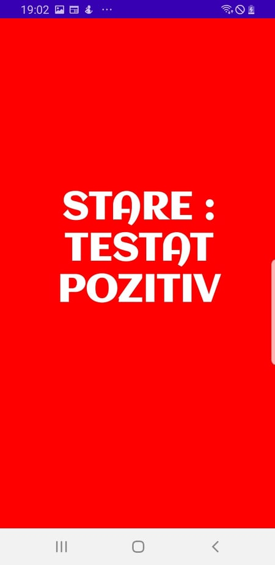

MedicalApp

Covid-19 detect V1.0 Beta

Avand in vedere situatia curenta la nivel global a situatiei pandemice de Sars Cov-d 2 .In conditile in care in prezentul redactiei 24/06/2020 am ajuns la cca. 25.000 de cazuri confirmate pozitiv pe teritoriul Romaniei si cca. 10 milioana la nivel planetar cu o crestere zilnica de aproximativ 300 de cazuri pe zi inRomania si 200.000 in lume. Instaurand o vasta nesiguranta in randul oamenilor ,datorita dificultatii de testare a pacientilor. Am ales sa aleg aceasta tema pentru creearea acestei aplicatii mobile ce faciliteaza verificarea starii (testat negative, testat pozitiv, vindecat si netestat) persoanelor in timp real.

Ce este pe scurt MedicalApp?

Medical app este o aplicatie mobile pe platforma sistemului de operare Android, aceasta are urmatoarele utilitati, se poate crea un profil, atat persoana fizica cat si juridica cu datele unei carti de identitate salvate in baza de date Firebase de la Google fiind pe parcurs verificate de o persoana autorizata care prin baza de date medical ava verifica starea de sanitate a utilizatorului si o va actualiza in timp real in baza de date, respectiv aplicatie.

Salvare datelor in baza de date se face astfel

`	`

Dupa o conectare sau inregistrare a contului in aplicatie, aceasta va ramane conecata pe dispozitiv pana la apasarea butonului de logout,conectarea se face prin email-ul si parola inregistrate.

`	`La deschidere, aplicatia prezinta un meniu de tip drawer ce poate fi tras din partea dreapta sau prin simpla apasare a butonului  din fereastra superioara.

`	`In fereastra principala se pot observa Indicatii in legatura cu comportamentul ce trebuie avut in legatura cu pandemia . Concret, indicatii ajutatoare pentru utilizarea corecta a mastilor chirurgicale.

Meniul de tip drawer din partea stanga are doua sectiuni (General si Verifica Stare), care impreuna au patru optiuni si un buton (Acasa, Profil, Generare Profil QR , Verificare si butonul de logout).

La apasarea categoriei “Profil”,utilizatorul va fi redirectionat spre fereastra profilului unde are la dispozitie un buton pentru editarea datelor.

 

Verificare Starii De Sanatate

La selectarea categoriei “Generare Profil QR”, se va deschide o fereastra care prezinta un cod QR ce contine datele de sanitate ale profilului , care scanat de un alt utilizator al aplicatiei, va declara starea de sanatate a acestuia.

In cele din urma , ultima categorie a meniului,  si anume “Verificare”, va deschide prin camera dispozitivului un scanner pentru scanarea codului QR prezentat anterior.

La succesul scanarii codului,  se va afisa o fereastra ce afiseaza starea de sanatate a codului QR al utilizatorului scanat alaturi de culoarea reprezentativa starii acestuia.

Exista astfel 4 stari posibile:

